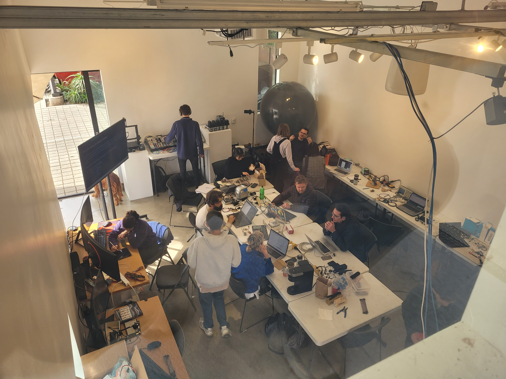

# Synthesizer Design Hackathon - Santa Barbara 2024

(from the Hackathon 2023)

**Final project videos:**

(from the Hackathon 2023)

-----

**Dates:** February 9-12 (Friday-Monday)

**Time:** 10am til afternoon

**Location:** SBCAST, 513 Garden St, Santa Barbara

**Hosts:** Karl Yerkes, Graham Wakefield

We are hosting a local synthesizer design hackathon hosted by MAT, UCSB and SBCAST. It is part of an international project sponsored by [Synthux Academy](https://www.synthux.academy), [Electro Smith](https://www.electro-smith.com), [Cycling`74](https://cycling74.com), and [Arturia](https://www.arturia.com/?gclid=CjwKCAiAioifBhAXEiwApzCztux6GyLSWwjfZP6dyDkH2szYwakcfsUeglHFjZN-qWaX-ZYkZYHA4BoCknkQAvD_BwE) with many universities and institutions around the world taking part through January and February.

(For more info see https://tsemah.notion.site/International-Synth-Design-Hackathon-90930f2fe12f42ae88ada91002b306fd)

**Build an experimental synth instrument, sound art or experience involving sound**

Participants make anything from sound art devices to interactive installations to musical instruments or sculptures, but really the program is open-ended. The only ground rule is that projects must be connected to the theme and one of the prompts provided on the first day.

[Examples of projects from the 2022 event](https://www.synthux.academy/events/hackathon-2022) 

[Examples from 2023](https://www.youtube.com/playlist?list=PLBrCYHmNvufXVNvckps2vle7oMiF7yNIy)

**What tools and parts are available?** Thanks to MAT, we have a pool of essential components an interesting sensors to build the projects. We also have some Electro-Smith [Daisy](https://www.electro-smith.com/daisy/daisy) microcontrollers, which can be programmed using C++, Max/MSP's gen~, or Pure Data. We'll be giving an introductory session about [the Max/MSP gen~ workflow](https://github.com/electro-smith/oopsy) on the first day. 

**What will happen?** It is a 4-day affair with a modest budget for lunch. You will receive a theme and a set of prompts to choose from on the first day. We can't tell you what they are before the event, but... we like them and it is all very MAT. 

  - Day 1: We will introduce the theme and hackathon, and work through a couple of minimal examples using the hardware available, then you'll dive into brainstorming and designing. You are encouraged to explore human-centered design. 
  - Days 2 and 3 are all about prototyping. By the end of the third day your project should be completed
  - Day 4 is reserved for documenting and submitting the project to the SynthUX competition. 

**What is the SynthUX hackathon?**
Launched by [Synthux Academy](https://www.synthux.academy), the International Synth Design Hackathon is a global event hosted by 17 academies, where students and researchers of music technology, engineering, computer science, design and art, design interactive sound experiences over a 4-day sprint in January or February 2024. 

**Prizes.** Although this is not a contest, some truly amazing companies offered to give away their products to participants, among all the hackathons happening around the world. 
